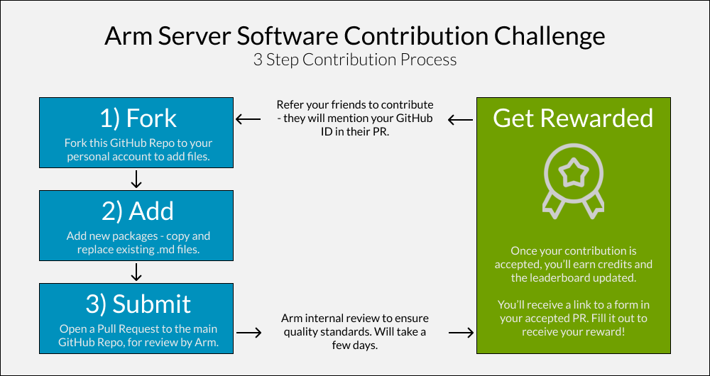

# Arm Server Software Contribution Challenge
Welcome to the Arm Server 

The new Ecosystem Dashboard for Arm is the place to see all the software packages that run on Arm Linux Servers. It is helpful for developers migrating/porting their apps to Arm servers to quickly understand what runs on Arm, the correct versions, and getting started/optimization tips. 

However, there is so much Arm software support today that we need our community of Arm developers to help populate the list packages. From libraries to languages to frameworks, contribute your expertise to strengthen the Arm ecosystem – while earning recognition and rewards!

## Rules - contribute & refer
Earn credits, get rewarded. There are two ways to earn credits: contribute package(s), and refer friend(s).

Contribute a package and you'll earn **1 credit** once its accepted. Refer a friend, and you will earn **3 credits** once that friend contributes a package that's accepted. Your friend will get **1 credit** per contribution. There's a limit of 15 total credits you can earn through referrals.

Once you reach the following credit threadholds, you'll automatically earn that reward and can redeem it by filling out a form:

| Tier          | Credits     | Reward   |
| ------------- | ----------- | -------- |
| Contributor   | 1           | Discord badge, contribution sticker     |
| Explorer      | 5           | SWAG - Arm Ecosystem T-shirt            |
| Pioneer       | 20          | 50 cloud credits to your favorite CSP   |
| -------       | ------      | --------------------------- |
| Leader        | Top 3       | Arm Expert hour long 1on1   |

The top three people with the most credits at the end of the challenge will be publically recognized as Arm cloud leaders, and have the opportunity for an hour long 1on1 meeting with Arm cloud engineering experts. Progress will be tracked on [this leaderboard](https://www.google.com) in this repository.

This challenge ends on **Dec 1st, 2024**.

## Example packages
These are the types of packages you should look to contribution. In short, if it would help a developer migrate to Arm, it should be included.

| **Category**                             | **Examples**                                                                 | **Comments** |
|----------------------------------------  |------------------------------------------------------------------------------|--------------|
| **Languages (Interpreted and Compiled)** | Python, Java, Ruby, Perl, PHP, JavaScript / C++, C#, Go, Rust, Fortran, Swift                                    |  |
| **Tools and Libraries**                  | x265, OpenSSL, Boost, TensorFlow, NumPy, libc, htop, perf, nmon, sysstat, dstat, gdb, valgrind, strace, CMake, Make, Bazel, apt, yum, pacman, iptables, firewalld                                | Provide functionality directly integrated or used by an app (includes packages within interpreted/compiled langauges) |
| **Frameworks and Middleware**            | Django, Spring, Ruby on Rails, Express, Laravel, Apache Hadoop, Apache Spark, PyTorch, Keras, scikit-learn, Istio, Consul, Jenkins, GitLab CI/CD, CircleCI, RabbitMQ, Apache Kafka, Kong, NGINX, Snort  | Provide higher-level abstractions and services that are used to build or support applications. |
| **Databases**                            | MySQL, PostgreSQL, SQLite, MongoDB, Cassandra, Redis                         |  |
| **Virtualization/Containerization**      | KVM, QEMU, Docker, Kubernetes, Docker Swarm, LXC/LXD                         | |
| **HPC Packages**                         | OpenMPI, MPICH, SLURM, Torque, HDF5, OpenBLAS, ATLAS, BLIS, LAPACK, PETSc, FFTW | Specify the implementations of specifications (such as OpenBLAS, ATLAS, and BLIS implementing the BLAS specification) |

# Leaderboard
Congratulations and thank you from Arm to all contributors recognized in the [Arm Server Software Contribution Challenge](google.com) leaderboard! This board is updated when contributions are reviewed and accepted every few days.

  
Overall Leaderboard

  | **Medal** | **Rank** | **GitHub Handle** | **Points** |
  |-----------|----------|-------------------|------------|
  | 🥇        | 1        | @user1            | 150        |
  | 🥈        | 2        | @user2            | 140        |
  | 🥉        | 3        | @user3            | 130        |
  |           | 4        | @user4            | 120        |
  |           | 5        | @user5            | 110        |
  |           | 6        | @user6            | 100        |
  |           | 7        | @user7            | 90         |
  |           | 8        | @user8            | 80         |
  |           | 9        | @user9            | 70         |
  |           | 10       | @user10           | 60         |

  
July Leaderboard

  | **Medal** | **Rank** | **GitHub Handle** | **Points** |
  |-----------|----------|-------------------|------------|
  | 🥇        | 1        | @user1            | 50         |
  | 🥈        | 2        | @user2            | 45         |
  | 🥉        | 3        | @user3            | 40         |
  |           | 4        | @user4            | 35         |
  |           | 5        | @user5            | 30         |

