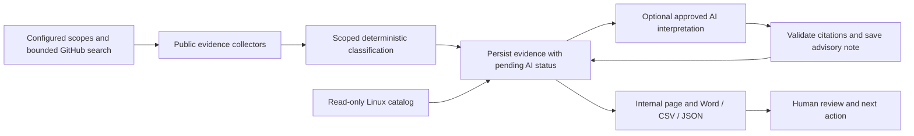

# Internal Linux Arm64 opportunity report PoC

This is Pareena's **support-gap discovery** PoC: inspect selected public project
repositories and container distributions, retain dated evidence, and produce an
internal list of enablement opportunities. A package can already be represented
in the Linux dashboard and still have a gap in a particular release or image tag.
The public dashboard and conversational search are unchanged.

## Run and review locally

Python 3.11+ on Linux or macOS is required. From the repository root:

```sh
python3 -m venv .venv
.venv/bin/python -m pip install -r poc/discovery/requirements-dev.txt
.venv/bin/python -m poc.discovery.serve
```

Open <http://127.0.0.1:8766/> and choose **Run discovery**. The local page shows
current counts, scoped findings, evidence, history, unfinished work and report
downloads. It binds to loopback only. PoC1 can remain on port 8765 independently.
The page is a local review tool, not an authenticated staging deployment.

For a CLI run without a web server:

```sh
.venv/bin/python -m poc.discovery \
  --config poc/discovery/config.example.yaml \
  --output-dir .poc/discovery \
  --catalog content/linux
```

`--catalog` reads Linux package front matter directly; no Hugo build or PoC1 API
is needed. JSON/YAML snapshots are also accepted. Optional `GITHUB_TOKEN` raises
the public API allowance. Private/internal GitHub repositories are rejected even
when the token could access them. Credentials are not saved in reports or state.

Outputs remain beneath `.poc/` (git-ignored). Stop the local server with Ctrl-C.
Use a separate output directory for a new investigation scope. To intentionally
recheck existing observations, set `force_refresh: true` in a copied configuration.

## What the pilot demonstrates

1. **Select relevant scopes.** Six explicit repository/image-tag seeds illustrate
   different evidence conditions. A GitHub query selects up to two additional
   previously unseen repositories, ordered by stars. Selection reasons, dated
   stars, cumulative image pulls and maintenance context stay visible.
2. **Collect authoritative metadata.** GitHub repository metadata, stable releases,
   paginated release assets and release-tag README excerpts (or default-branch
   README context when no stable release is available, retaining blob identity); Docker Hub tag
   platforms and repository statistics; OCI manifests/config metadata when Hub
   evidence is insufficient. No source code, image layers or binary assets run.
3. **Classify conservatively.** Deterministic rules decide supported, identified
   gap or unknown for the selected artifact/tag. Optional AI provides a cited
   advisory interpretation; it cannot replace the evidence verdict.
4. **Remember investigations.** SQLite stores candidates, observations and due
   dates. Dashboard URL matching and earlier local investigations provide
   context; already-cataloged projects are not excluded from evidence collection.
5. **Generate an internal report.** People review gaps and unknowns, check existing
   internal ownership, and decide follow-up. No automatic dashboard update,
   issue creation, maintainer contact or external report publication occurs.



### Evidence policy

| Finding | What establishes it | Meaning and limit |
| --- | --- | --- |
| Supported | An uploaded artifact explicitly names Linux and Arm64/aarch64, or runtime platform metadata includes Linux Arm64 | Advertised distribution support for that artifact/tag; no runtime certification or all-component claim |
| Identified gap | A complete, unambiguous release binary inventory includes other Linux architectures but no Linux Arm64 artifact; or a complete runtime tag inventory excludes Linux Arm64 | A scoped distribution gap; does not prove the whole project cannot run on Arm |
| Unclear / unknown | Missing releases, ambiguous names, incomplete inventory, unknown platforms, API failure or exhausted evidence budget | Requires investigation; never automatically unsupported |

Windows/Darwin Arm64 and 32-bit Arm are not Linux Arm64. Known ancillary files
(signatures, checksums, SBOMs, docs and source archives) are not Linux binaries.
OCI attestations and non-runtime artifacts are distinguished from runnable
images. Single-platform manifests need OS/architecture from their config blob.
When artifact size is supplied, it must be a positive integer; empty or invalid
sizes cannot establish either support or an other-architecture-only gap.
README statements are contextual evidence and cannot promote a binary-distribution
verdict. A default-branch README is labeled as repository context, not release documentation.
Positive artifact evidence can establish a scoped supported finding despite an
unrelated incomplete inventory; its collection issue remains visible.

Release selection is the first non-draft, non-prerelease in GitHub API order,
within pagination caps. It is not a promise of the greatest semantic version.
The selected legacy `library/mysql:5.7` seed illustrates a tag-specific gap,
**not a claim about current MySQL or all MySQL versions**. The Redis repository
and Redis container are deliberately separate evidence scopes.

### Selection, popularity and limits

The small demonstration is a bounded sample, not an exhaustive top-software
ranking. Public visibility does not certify an OSI-approved license: collected
license metadata and any commercial editions still need review. Seeds are chosen
explicitly; GitHub query results are ranked by stars. Registry discovery starts
with configured Docker Hub image/tag seeds; it does not crawl all registries.

| Default limit | Meaning |
| --- | --- |
| 40 source records | Maximum GitHub search records read across configured queries before deduplication; separate from six explicit seeds |
| 2 discovered candidates | Maximum previously unseen GitHub repositories selected from those search records |
| 8 investigations | Maximum repository/image scopes investigated across new and due work in one run |
| 50 metadata requests | Total public-source HTTP calls across discovery, evidence and optional metadata |
| 180 seconds | Source collection time budget, checked before and during reads; an in-flight call can consume its remaining timeout |
| 15 seconds / 2 MB | Per-request timeout and maximum response size |
| 1 search / 2 release / 4 asset pages | Pagination caps; incomplete evidence remains unknown where absence must be proved |

These are maximum workloads, not promised findings. Six seeds plus two selected
search results can yield eight checks. If only one new relevant result exists,
only that one is added. A failure is recorded; no retry loop searches indefinitely
for a desired number of gaps.

Saved due work runs first. Within the same batch, seeds keep their configured
order and discovered repositories keep star-based priority. Stars and pulls use
different units and are never added into one score. Docker pulls are cumulative
registry activity, not unique deployments; a publisher badge is provenance
context, not Arm certification. Unavailable statistics are `null`, not zero.

Known candidate identities are skipped during new discovery. A repeat run can
select the next unseen results in the configured pool. Once all results inside
the bounded pool are known, no new candidates are promised; maintainers can
review the query/topic/pool size in configuration. Candidates selected into the
saved queue survive subsequent seed changes; unselected search results may be
encountered again and are not an exhaustive persisted crawl frontier.

### Memory and repeat runs

Supported and gap findings are due after seven days; unknown findings after one
day, configurable. Earlier findings retain their original dates and evidence.
The same source identity/tag does not become a new investigation just because
it is absent from the dashboard. A moving tag's next refresh records available
digests and preserves the previous observation. Whole-project matching across
unrelated repositories/images is not guessed.

A process-level lock prevents simultaneous runs against the same local SQLite
state. It is released on a crash. Each completed observation is saved before
AI interpretation and report generation. Collection finishes before AI begins,
so model latency cannot consume another candidate's collection allowance. Each
pending advisory status is committed and then updated after interpretation; a
crash retains the evidence and discloses unfinished AI work. Failed or pending AI
reviews are not silently retried until that candidate is due (or a deliberate
`force_refresh` run); historical Word/JSON/UI findings retain their AI status.
If generation fails, the run is recorded as failed, the
previous `latest.json` stays available, and a later run can report the saved
observations without duplicating investigation. Interrupted runs are marked on
next startup. Recent failed runs remain visible in report diagnostics.

Catalog comparison extracts exact GitHub/Docker Hub URLs and explicit repository
aliases. No URL match means **no match found**, not proof the project is absent
from all dashboard or internal tracking. There is no Jira/internal ownership
connector in this PoC; recommended actions explicitly ask people to check it.

### Reports and review experience

Each run writes `OUTPUT/RUN_ID/opportunities.docx`, `.csv` and `.json`, then
atomically replaces `OUTPUT/latest.json` after the report set succeeds.

- **Word:** business review, grouped gaps/unknowns/supported scopes, popularity,
  evidence links, dates, recommended actions, historical findings and coverage.
- **CSV:** spreadsheet filtering. `record_type=checked_this_run` and
  `historical_not_rechecked` prevent old results being counted as new.
- **JSON:** full evidence and run metadata, queue, skipped/excluded records,
  source failures, refresh dates, original observations and report paths.

`findings` and status counts describe only this run. `retained_findings` contains
historical observations not rechecked. `queue` contains selected candidates still
awaiting first investigation. Skipped records include not-due, excluded and
budget-deferred work with reasons. A run with zero fresh findings still produces
a report and retains historical findings.

The browser UI renders source text as text, filters by finding status, expands
evidence, and downloads only reports beneath the configured output directory.
Run requests require the same local origin and a session token. No public
production routes, catalog content, workflow-generated tests or PoC1 files change.

## Optional AI: integration dependency remains explicit

The included adapter is implemented and validated with controlled provider
responses. **The live pilot currently runs with AI disabled.** An approved model
endpoint, entitlement and data policy must be confirmed before enabling it;
existing onboarding/Arm-Debug authorization is not assumed to transfer.

For an approved OpenAI Responses deployment, set dedicated server-side
`ARM_DISCOVERY_OPENAI_API_KEY` and `ARM_DISCOVERY_MODEL` (or `ai_review.model`), then
set `ai_review.enabled: true`. Generic IDE `OPENAI_API_KEY` credentials are not
reused. This adapter targets `https://api.openai.com/v1/responses`; it is not an
Azure/Arm-Debug adapter or a claim those services are authorized. A different
approved provider can implement `run_pipeline(..., reviewer=callable)` with the
same review contract.

Only bounded public evidence excerpts, publicly derived scope and status are
submitted, with `store: false`. Scope is limited to 2,000 characters, excerpts to
8 × 1,600 characters and serialized input to 48 KB; oversize URLs are omitted
rather than shortened, and truncation is disclosed. AI's separate time budget
counts active request time, not source collection or idle time between calls.
Explicit authentication prevents unrelated local `.netrc` credentials from
being sent to sources or replacing the dedicated model credential; configured
proxy/CA environment support is retained. The reviewer returns `note` and `citations: [{url, quote}]`.
Every quote and URL must match collected evidence or the review is rejected.
Citation matching establishes traceability, **not semantic correctness** of all
model prose; human review remains necessary. Source text is treated as untrusted
data, not instructions. Refusals, malformed output, unavailable credentials,
invalid quotes and exhausted call/time/output budgets are disclosed. AI cannot
change deterministic classification or trigger follow-up actions. The example permits
four AI calls for up to eight investigations; review the call/time allowances when
enabling it. For complete advisory coverage of eight eligible findings, configure
at least eight calls and an approved time allowance, then use `--require-ai` to
reject incomplete coverage rather than silently claiming AI completion.

## Validation and delivery boundaries

```sh
.venv/bin/python -m pytest poc/tests -q
node --test poc/tests/ui_discovery.test.cjs
```

`requirements.lock.txt` records the original local validation environment.
Production and CI use the separate hash-locked dependency files in `deploy/`;
see the deployment runbook for platform-specific installation and updates.

The dedicated CI workflow runs synthetic tests, builds the production batch
image on a GitHub-hosted Linux Arm64 runner and exercises its default command
with persistent private state and no network. It uses no source/model secrets
and uploads no live report. The crawler has **no enabled schedule**.

## Internal batch deployment

The [deployment runbook](deploy/README.md) includes an immutable-base, nonroot
container, runtime-only hash-locked dependencies, private persistent state,
manual acceptance commands and disabled systemd service/timer examples. The
production image exposes no web server. The loopback UI is a separate local demo.
A single private host and durable local filesystem own the queue and history;
ephemeral CI caches must not be used as the sole investigation memory.

- `--fail-on-errors`: publish recoverable findings, then exit **2** if the current
  run had source, catalog or AI errors. An ordinary unknown finding is not an
  operational error. Historical failures remain visible without failing a later
  healthy run. `outcome` and `current_errors` provide machine-readable health.
- `--require-ai`: fail before collecting when AI is disabled or unconfigured;
  after collection, exit **2** if any eligible fresh finding lacks a completed
  advisory review. Use with `--fail-on-errors` for approved AI acceptance. A
  no-work run is valid but does not prove live AI behavior.
- Exit **1** means configuration, state, report publication or another fatal
  operation failed. Previous complete reports and committed observations remain.

Source and AI budgets are separate. The deployment service adds a ten-minute
outer deadline and targeted container cleanup. Operators must validate the real
host, approved credentials, alerts, image scan, backup/restore and retention
before enabling its weekly timer. See [RESULTS.md](RESULTS.md) for what was
actually validated and what still requires deployment acceptance.

Tests cover classification, malformed data, pagination, request limits, private
source rejection, optional AI request/citation handling, queue/refresh behavior,
report failure recovery, CSV safety, Word structure and local HTTP boundaries.
See [RESULTS.md](RESULTS.md) for actual validation and remaining live checks.

This PoC does not execute builds/tests, prove source-build compatibility, verify
binary contents, crawl every registry, certify licenses or automatically decide
whether an opportunity is commercially important. Runtime validation, broader
connectors and automated internal ownership matching are separate extensions.

Official references: [GitHub repository search](https://docs.github.com/en/rest/search/search#search-repositories),
[release assets](https://docs.github.com/en/rest/releases/assets#list-release-assets),
[GitHub pagination](https://docs.github.com/en/rest/using-the-rest-api/using-pagination-in-the-rest-api),
[Docker Hub API](https://docs.docker.com/reference/api/hub/latest/),
[OCI image index](https://github.com/opencontainers/image-spec/blob/main/image-index.md),
[OCI configuration](https://github.com/opencontainers/image-spec/blob/main/config.md),
[OpenAI structured outputs](https://developers.openai.com/api/docs/guides/structured-outputs).
